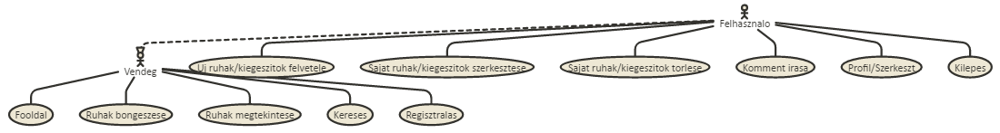
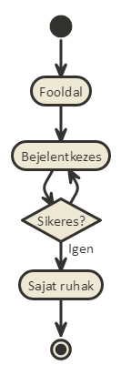
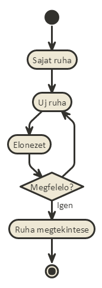
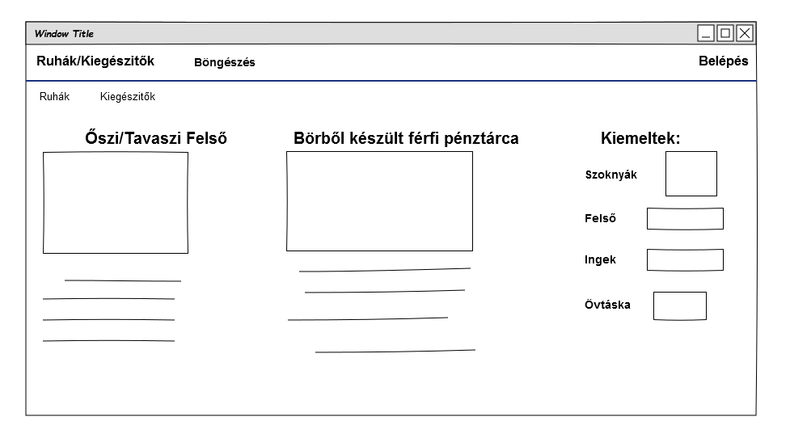
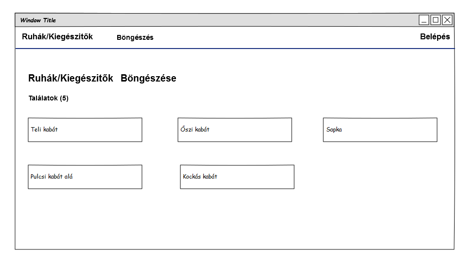
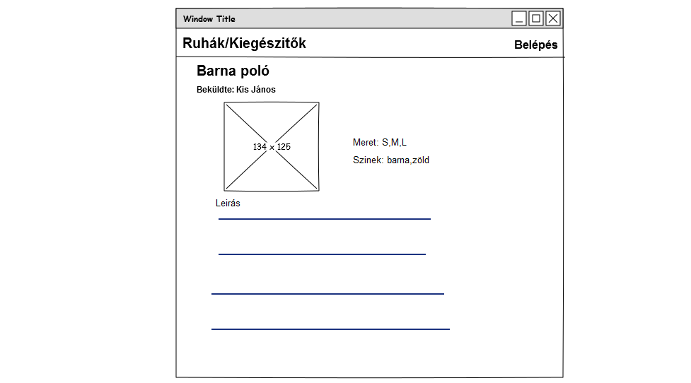
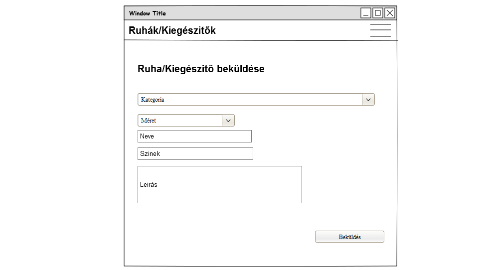
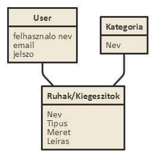

#Dokumentáció

###Készítette: Tókos Bence

#Ruhák

##1. Célkitüzés:
Egy olyan webes alkalmazás fejlesztése ami érthetően megjeleníti a ruhák/kiegészítők külömböző típusait.
Az adatok védelme érdekében lehetőség van regisztrációra, majd bejelentkezésre. A bejelentkezett felhasználoknak joguk van modosítani a saját maguk által feltöltött ruhák/kiegészítök adatait,törölhetik azt illetve újakat tölthetnek fel.

##2. Funkcionális követelmények:

###2.1 Vendégként:
<ol>
<li>Látom a főoldalon a kiemelt ruhákat/kiegészítőket kategóriánként</li>
<li>Tudok a ruhák/kiegészítők között böngészni</li>
<li>Látom a ruhák/kiegészítők leírását</li>
<li>Tudok ruhákat/kiegészítőket keresni</li>
<li>Tudok regisztrálni az oldalra</li>
</ol>

###2.2 Felhasználóként:
<ol>
<li>A vendég tulajdonságai</li>
<li>Betudok jelentkezni az oldalra</li>
<li>Tudom a profil adataimat szerkezteni</li>
<li>Tudok új ruhát/kiegészítőt feltölteni</li>
<li>Tudom a saját magam által feltöltött ruhákat/kiegészítőket modosítani,törölni</li>
<li>Tudok kommentet írni</li>
</ol>

##3. Nem funkcionális követelmények:
<ol>
<li>Könnyű átkinthetőség: Színekkel csoportosítás</li>
<li>Használhatóság: kategoriák,ésszerű elrendezés</li>
<li>Megbizhatóság: jelszavak védelme</li>
</ol>

##4. Szakterületi fogalomjegyzék:
### A ruhák méretei lehetnek:
<ol>
<li>S</li>
<li>M</li>
<li>L</li>
<li>XL</li>
<li>XXL</li>
</ol>

##5. Szerepkörök:
###Vendég: ruhákat/kiegészítőket kereshet,megtekínthet
###Felhasználó: a vendég szerepkörén túl a saját ruhájinak/kiegészítőinek kezelése (új,modosít,törlés)

##6. Használati esetek:

##7. Folyamatok meghatározása:
###Bejelentkezés:

###Új ruha/kiegészitő:

##8. Oldaltérkép:
######  -Főoldal 
######  -Ruhák/kiegészítők böngészése 
######       +Ruhák/kiegészítők megtekintése 
######   -Belépés 
######   -Regisztráció

######Felhasználó
######  -Kilépés
######  -Profiladatok
######    +Profil szerkesztése
######   -Új ruha/kiegészítő felvitele
######   -Saját ruhák/kiegészítők szerkesztése
 
##9. Végpontok:
####*GET/:főoldal
####*GET/login:bejelentkező oldal
####*POST/login:bejelentkezési adatok feltöltése
####*GET/profile:profiladatok
####*GET/kategoriak:kategoria lista
####*GET/ruha/kiegészítő/:id:ruha/kiegészítő megtekintése
####*GET/ruha/kiegészítő/create:új ruha/kiegészítő űrlap
####*POST/ruha/kiegészítő/create:új ruha/kiegészítő felvitt adatok küldése

##10. Oldalvázlatok

##11. Adatmodell

